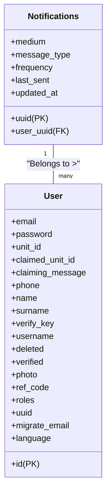

# ADR 010: Notifications System

### Changelog
* 2023-07-31: Initial draft

### Status
DRAFT Not Implemented

### Abstract
The notifications will allow users to receive notifications based on their preferences. This system will use a combination of technologies, including Next.js, TypeScript, Hasura, PostgreSQL, and CloudFlare Workers. It will also interact with a third-party API, SendGrid, to handle email delivery.

### Context
The goal is to implement a system that can generate and send emails based on user preferences. These preferences include language, message type (activity reports, game notices), and frequency of emails. A cron job will run every 10 minutes to query the database for users who need to receive messages, batching and sending a maximum of 100 messages each time.

### Third-Party Solutions
Considering third-party solutions for managing the email notifications like SendGrid Email Automation or MailChimp would offload the responsibility of building and maintaining this system from our team. However, these services may lack the level of customization we desire and could potentially increase costs. 

### Database Design

Our initial approach is to add new tables to our existing PostgreSQL database managed by Hasura. We'll create a `notifications` table, with each user potentially having multiple notifications, creating a one-to-many relationship from `users` to `notifications`.



This design allows us to efficiently query all notifications for a specific user. To ensure efficient querying, `user_uuid` will be indexed as it's a foreign key. Also, `uuid` will serve as the primary key for the `notifications` table.

Intial message types will be:
- activity_report (has frequency setting)
- game_notice
- newsletter

### Query Design
We will need to use a GraphQL query that checks if there are valid messages to send based on the frequency set by the user and whether the current time is within +/- 2 hours of the time of day the user last logged in. A potential query might look like this:

```graphql
query GetNotificationsToSend {
  notifications(where: { 
    _and: [
      { _raw_sql: "(extract(epoch from now()) - last_sent) >= frequency" },
      { user: { last_login: { _gte: "current Unix timestamp - 7200" , _lte: "current Unix timestamp + 7200"} } }
    ]
  }) {
    uuid
    user_uuid
    message_type
  }
}
```
This query will return the uuid, user_uuid, and message_type of notifications that match the conditions.

### Worker vs Hasura Cron
Both CloudFlare Workers and Hasura offer cron-like features. However, we will utilize CloudFlare Workers as they allow us to write JavaScript that can easily interact with third-party APIs like SendGrid. 

### Decision
The system will be built using the following technologies:
* **Next.js & TypeScript:** for the user preferences interface.
* **Hasura & PostgreSQL:** to manage the database of user preferences, profiles, and notifications.
* **CloudFlare Workers:** to handle the cron job for querying users and sending emails.
* **SendGrid API:** to manage email delivery.

### Consequences
#### Positive
* Customizable notifications improve user experience.
* Cron job optimizes system resource usage.
* Third-party email service ensures deliverability and handles email-related issues such as bounces.

#### Negative
* Regularly scheduled jobs add a layer of complexity to the system.
* Relying on a third-party email service introduces external dependencies.

#### Neutral
* User opt-outs will be handled by enabling users to login and update their preferences. Changes will reflect immediately and influence the subsequent run of the worker script.

### Further Discussions
* Methods to ensure users are not sent duplicate notifications: To prevent this, we update the `last_sent` column each time a notification is sent. We ensure that users receive notifications according to their chosen frequency and avoid sending duplicates.
* This same system could also be used for other notification types such as sms, push, and cross-platform tags. 

### References
- [SendGrid Documentation](https://sendgrid.com/docs)
- [Hasura Documentation](https://hasura.io/docs/1.0/graphql/manual/index.html)
- [Next.js Documentation](https://nextjs.org/docs)
- [TypeScript Documentation](https://www.typescriptlang.org/docs/)
- [CloudFlare Workers Documentation](https://developers.cloudflare.com/workers/)
