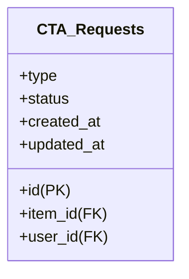

# ADR 011: Item CTA Buttons

### Changelog
* 2023-08-18: Initial draft

### Status
DRAFT Not Implemented

### Abstract
This ADR proposes the addition of CTA buttons such as Book, Buy, Register, etc., to items such as user's project, user's post, user's product, and user's event. These buttons are designed to boost user interactions and can be expanded to include payment integrations in the future.

### Context
The goal is to increase user engagement and interaction by enabling actions directly from the items. The actions will be handled automatically for logged-in users, and public visitors will be prompted to log in or create an account via OAuth, eliminating the need for forms, captchas, and redirections.

### Front-end Changes
The following changes would be needed on the front-end:
* Adding CTA buttons to the item's component.
* Prompting public visitors to log in or create an account via OAuth.
* Notifying users that the request was sent successfully.

### Back-end API Changes
On the back-end, the following changes would be required:
* Creating new endpoints to handle CTA requests:
    * `POST /cta/request`: To handle request submission.
    * `GET /cta/actions`: To retrieve actions related to the user.
* Implementing email notifications to both the poster and the requester.
* Adding a new event type \`cta_request\` in the actions table.
* Ensuring proper authentication for logged-in users.

### Database Design
A new table `cta_requests` would be needed with the following fields:

This design captures the CTA requests along with the status and type of action.

### Suggested CTA Button Labels
For different types of items and CTAs, the following button labels can be considered:

#### Reservation:
* "Reserve Now"
* "Book a Spot"
* "Claim Your Reservation"
* "I'm Interested"

#### Buying a Product:
* "Buy Now"
* "I'm Interested"
* "Purchase Today"

#### Registering for an Event:
* "I'm Interested"
* "Join the Event"
* "Sign Up Today"

#### Other General Interactions:
* "Explore More"
* "Learn More"
* "Get Started"
* "I'm Interested"

### Consequences
#### Positive
* Increases user engagement and interaction with the items.
* Quick implementation.
* Smooth user flow without extra steps.

#### Negative
* Maintenance of additional API endpoints and database tables.

#### Neutral
* Handling the flow for both logged-in and public users might require thorough validation and security considerations.

### Further Discussions
* Integrating with payment gateways for direct purchases.
* Designing a form for future extensions to capture details such as #guests, quantity of product, etc.

Additional fields that might be needed in future extensions for various item types:

#### For Reservation:
* Number of guests
* Date and time
* Special requests

#### For Buying a Product:
* Quantity of product
* Size, color, or other variations
* Shipping address

#### For Registering for an Event:
* Number of attendees
* Preferred time slot

### References
* [OAuth Integration Guide](https://oauth.net/)
* [Email Notification Service Documentation](https://github.com/Ekonavi/ekonavi-adr-docs/blob/main/architecture-design-records/adr-010-notifications-system.md)
